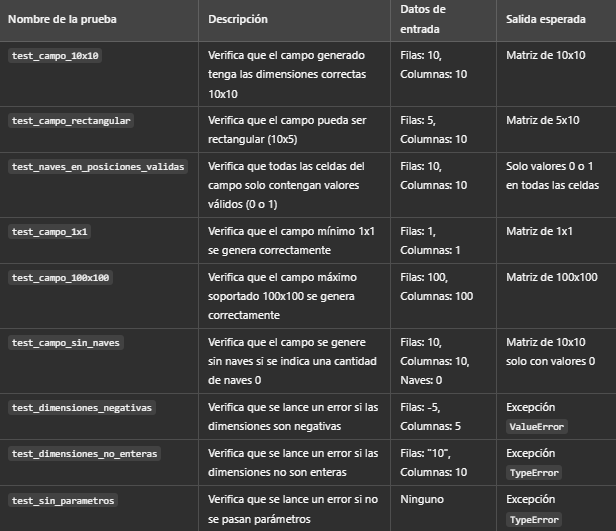
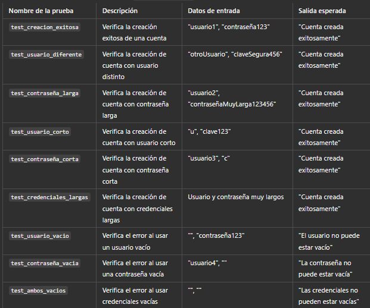

# Batalla Naval
Proyecto de juego Batalla Naval con pruebas unitarias.

Pruebas Unitarias - Proyecto Batalla Naval

Este documento presenta las pruebas unitarias realizadas para las funcionalidades principales del proyecto Batalla Naval.

Estructura de las Pruebas

Las pruebas están organizadas en el directorio tests y se dividen por funcionalidad.

Pruebas realizadas

1. test_iniciar_sesion

Descripción: Pruebas para verificar el proceso de inicio de sesión.

Ubicación: tests/test_iniciar_sesion.py

2. test_campo_juego

Descripción: Pruebas para la correcta inicialización del campo de juego.

Ubicación: tests/test_campo_juego.py

3. test_crear_cuenta

Descripción: Pruebas para el proceso de creación de una nueva cuenta.

Ubicación: tests/test_crear_cuenta.py

4. test_disparar

Descripción: Pruebas para verificar la acción de disparar en el juego.

Ubicación: tests/test_disparar.py

5. test_cambiar_contrasena

Descripción: Pruebas para verificar el proceso de cambio de contraseña.

Ubicación: tests/test_cambiar_contrasena.py

6. test_puntuacion

Descripción: Pruebas para verificar el sistema de puntuación del juego.

Ubicación: tests/test_puntuacion.py

Diagrama de clases:

instalar los requerimientos:
pip install -r requirements.txt

⚠️ Antes de ejecutar setup_db.py, asegúrate de tener PostgreSQL instalado, corriendo en el sistema y cambiar la contraseña del superusuario en el archivo setup_db.py si no es "postgres".
        
Configurar todo:
python setup_db.py

Para ejecutar las pruebas:
python -m unittest discover -s tests -p "*.py" -v

Para ejecutar el programa:
python menu_consola.py
python menu_grafico.py

# Ejecutar la versión web
cd web
python app.py
Pegar en el navegador la url proporcionada

